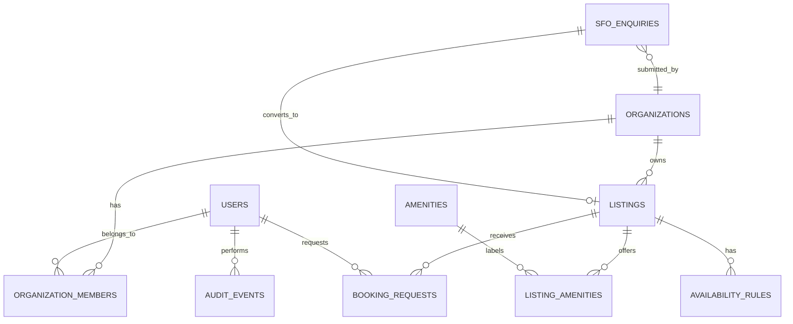

# Global Office Sharing & SFO Platform Architecture

**Status:** product and technical blueprint for the next production phase. The current site already provides the public partnership lead form, global-office discovery cards, staff authentication, a bookings/enquiries inbox, and a temporary browser-local office manager. This document defines how to turn those pieces into a multi-jurisdiction, database-backed platform.

## 1. Recommended architecture

```text
Public website / partner portal / staff dashboard (Next.js + TypeScript)
                         │
              Supabase Auth + Row Level Security
                         │
 Next.js server actions / API routes (validation, audit and workflow)
                         │
PostgreSQL + Storage + Edge Functions ── Email / CRM / payment provider
```

### Stack

| Layer | Recommendation | Why |
| --- | --- | --- |
| Web application | Next.js App Router, React, TypeScript, Tailwind/shadcn | Current application foundation; fast public pages and reusable dashboard UI. |
| Authentication | Supabase Auth with staff, partner, client roles | Magic link/password login, MFA options, and database RLS integration. |
| Data | Supabase PostgreSQL | Relational bookings, transactions, geospatial search, audit history, and RLS. |
| Rich text | MDXEditor or TipTap, storing sanitised HTML/JSON | Structured SFO descriptions with preview and revision history. |
| Images/documents | Supabase Storage with signed upload URLs | Keep office imagery and compliance documents private until published. |
| Payments (phase 2) | Stripe Connect / manual invoice workflow | Enables deposits and partner payout reconciliation. |
| Notifications | Supabase Edge Functions + Resend/Postmark | Send lead, booking, approval, cancellation, and SLA notifications without exposing credentials. |
| Search | PostgreSQL indexes + PostGIS; add Algolia only if needed | City/country, capacity, amenity, date and map searches at low operational cost. |

### Trust and security requirements

- Public visitors can read **published** listings and request/book only; they cannot query leads, partner details, or other bookings.
- Partners can edit only listings assigned to their organisation and see only their own booking requests.
- Staff can manage all workflow; sensitive SFO documents use private storage and signed URLs.
- Write an immutable `audit_events` row for publishing, booking status changes, SFO conversion, and price changes.
- Store local operating timezone per listing; calculate availability in the location timezone, while keeping timestamps in UTC.
- Verify availability and price in a database transaction before a booking is confirmed—never trust browser-calculated totals.

## 2. Data model / entity relationship outline



### Core entities

| Entity | Key fields | Notes |
| --- | --- | --- |
| `profiles` | `id` (references `auth.users`), name, phone, role | Roles: `staff`, `partner_admin`, `partner_member`, `client`. |
| `organizations` | id, legal_name, type, country, status | `type`: SFO, office provider, corporate client, SmartHub. |
| `organization_members` | organization_id, user_id, role | Supports multiple staff/partners per organisation. |
| `listings` | id, organization_id, status, name, country, city, address, timezone, description_rich, capacity, currency, rate, rate_unit, visibility | Lifecycle: draft → review → published → hidden/archived. `slug` is public-safe. |
| `listing_amenities` / `amenities` | listing_id, amenity_id | Normalised filters such as boardroom, accessibility, concierge, secure internet. |
| `availability_rules` | listing_id, weekday/date range, start/end, min duration, blackout flag | Recurring hours and one-off closures. |
| `booking_requests` | id, listing_id, requester, starts_at, ends_at, people, quoted_total, status | Status: requested, held, confirmed, declined, cancelled, completed. Add an exclusion constraint for exclusive rooms. |
| `sfo_enquiries` | id, organisation/contact fields, country, city, raw_message, editable_description, status, assigned_to, converted_listing_id | Captures partnership/SFO leads and creates a traceable conversion path. |
| `listing_media` | listing_id, storage_path, alt text, sort order | Images, floorplans, compliance packs. |
| `audit_events` | actor, entity type/id, action, before/after JSONB | Governance and support evidence. |

### Critical database rules

1. `listings.status = 'published' AND visibility = true` is required for public reads.
2. `booking_requests` must reference a published listing; all quoted money uses `numeric(12,2)` plus ISO currency.
3. Apply a PostgreSQL exclusion constraint to block overlapping confirmed/held bookings for an exclusive listing.
4. The **Convert to listing** transaction creates a draft listing, attaches the source `sfo_enquiry`, and writes an audit event. It must be idempotent—an enquiry can be converted only once.
5. RLS policies use organisation membership rather than trusting a client-provided `organization_id`.

## 3. Public UX wireframes

### Global booking directory

```text
[Header / global navigation]
[Find your next workspace] [Location search] [Dates] [Search]
[Filters: Country/City | Capacity | Amenities | Duration | Available now]
----------------------------------------------------------------
[Map / results count]                   [Sort: Recommended]
[Office card] [Office card] [Office card]
 photo/city    photo/city    photo/city
 capacity      capacity      capacity
 amenities     amenities     amenities
 From price    From price    From price
 [View & book] [View & book] [View & book]
```

Listing detail: gallery → location/timezone → amenities/capacity → availability calendar → price breakdown → request/book CTA → provider/SFO trust information. On mobile, filters open in a bottom sheet and booking CTA remains sticky.

### Partnership lead page

```text
[Why list with SmartHub: global demand / operational support / controlled access]
[How it works: submit → review → profile refinement → publication]
[Office details: city, country, capacity, amenities, availability]
[Contact details: name, email, company, phone]
[Submit partnership enquiry]
```

Use progressive disclosure: contact details first, then office details. Save incomplete leads locally only with consent; submit to `sfo_enquiries` server-side.

## 4. Staff dashboard wireframe

```text
[Sidebar: Overview | Listings | Booking requests | SFO pipeline | Partners | Settings]
--------------------------------------------------------------------------
[Overview]  Pending leads | Awaiting approval | Today's bookings | Revenue

[SFO pipeline]                                                      [Search]
New → Qualified → Description review → Approval → Converted → Closed
[Lead card] [Lead card] [Lead card]       (drag only changes status after confirmation)

[Lead detail]
Contact / organisation / source / activity timeline
[Raw enquiry]       [Rich text SFO/listing description editor]
[Assign owner] [Request details] [Save draft] [Preview] [Convert to listing]

[Listings]
[Filters: status, country, partner]  [+ New listing]
Listing / Location / Visibility toggle / Rate / Next booking / actions
```

### One-click conversion workflow

1. Staff qualifies an incoming `sfo_enquiry` and opens **Description review**.
2. The rich-text editor starts with a template plus AI-assisted draft only after staff review; raw lead text remains unchanged for audit purposes.
3. **Preview** renders the exact public listing card/detail page.
4. **Convert to listing** creates a *draft* listing linked to the enquiry. Staff supplies capacity, rates, availability, media and amenities.
5. Staff publishes after compliance approval; partner receives notification and gains scoped access to their listing.

## 5. Delivery plan

- **Phase 1 — Foundation:** migrate browser-local global offices to `listings`; add organisations, member roles, published-only RLS, media, and public directory filters.
- **Phase 2 — Workflow:** add `sfo_enquiries`, pipeline status/assignment, rich-text editing, audit log, and draft conversion.
- **Phase 3 — Booking:** listing availability, transactional booking holds, timezones, email notifications, staff/partner approval screens.
- **Phase 4 — Commercial:** deposits/payments, partner reports, payouts, CRM sync, analytics and SLA automation.

The current partnership page should be treated as a working lead-generation surface, not the source of truth for published offices. Its temporary localStorage manager is suitable for prototype/demo data only and must be replaced during Phase 1.
